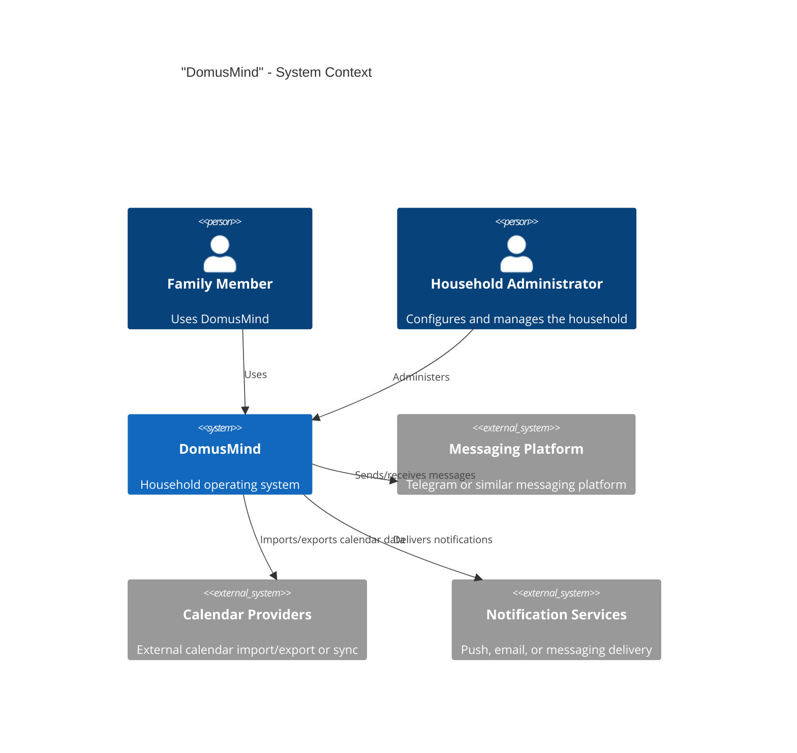

# DomusMind - C4 System Context

## Purpose

This document defines the external system context of DomusMind.

DomusMind is the central system that models and operates household life as structured domain state.

---

## Scope

DomusMind is responsible for:

- family structure
- responsibility ownership
- event scheduling
- task and routine execution

These capabilities form the V1 core of the system.

---

## Primary Actors

### "Family Member"

Uses DomusMind to:

- manage household structure
- see responsibilities
- schedule events
- execute tasks

### "Household Administrator"

A family member with elevated operational control.

Uses DomusMind to:

- configure the household
- manage ownership rules
- maintain overall household structure

---

## External Systems

### "Messaging Platform"

Optional interface for quick capture and notifications.

Example:

- Telegram

### "Calendar Providers"

Optional external calendar systems used for import/export or synchronization.

Examples:

- Google Calendar
- Apple Calendar
- Outlook Calendar

### "Notification Services"

Infrastructure used to deliver reminders and notifications.

Examples:

- push notifications
- email
- messaging adapters

---

## System Context Diagram

---

## Notes

DomusMind is the system of record for household operational state.

Authentication is implemented internally in V1.

External systems may provide transport, synchronization, or delivery capabilities, but they do not own the DomusMind domain model.
