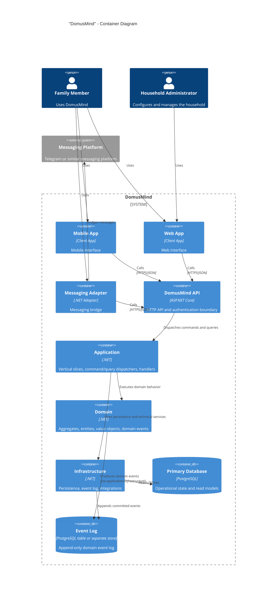

# DomusMind — C4 Container Diagram

## Purpose

This document defines the main runtime containers of DomusMind.

DomusMind is built as a domain-centric, API-first modular monolith with vertical slices, command/query dispatching, domain events, and an append-only event log.

Authentication is implemented **internally** as part of the DomusMind backend (ADR-002).

---

## Containers

### "Mobile App"

Primary user interface for household members.  
Uses the HTTP API.

### "Web App"

Administrative and desktop-oriented interface.  
Uses the HTTP API.

### "Messaging Adapter"

Optional interface for capture and notifications.  
Bridges platforms such as Telegram to the API.

### "DomusMind API"

Single system boundary for external clients.

Responsibilities:

- HTTP API surface
- authentication
- authorization
- command/query dispatching

### "Application"

Executes commands and queries through vertical slices and internal dispatchers.

### "Domain"

Contains aggregates, entities, value objects, and domain events.

Core V1 modules:

- "Family"
- "Responsibilities"
- "Calendar"
- "Tasks"

### "Infrastructure"

Provides persistence, event storage, integrations, and technical services.

### "Primary Database"

Stores operational state for aggregates and read models.

### "Event Log"

Append-only store for committed domain events, used for auditability, projections, and retries.

---

## Diagram

---

## Notes

Keep the container view small.

DomusMind V1 is deployed as a **modular monolith**, not a distributed system.

Authentication is implemented **inside the main backend**, not via an external identity provider.

