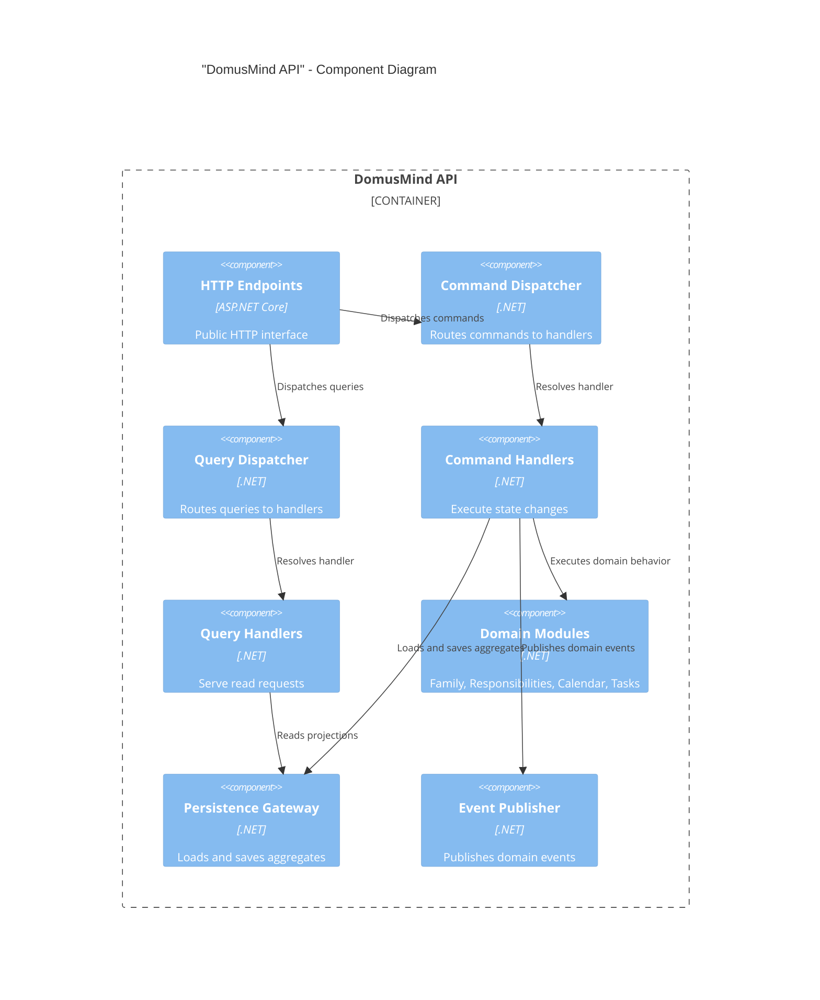

# DomusMind — C4 Component Diagram (API)

## Purpose

This document shows the internal component structure of the "DomusMind API" container.

The API exposes domain capabilities through vertical slices and dispatches execution into the application layer.

The API does not contain domain logic.

---

## Components

### "HTTP Endpoints"

Defines the public HTTP surface.

Responsibilities:

- request parsing
- authentication
- request validation
- dispatching commands and queries

Endpoints map directly to vertical slices.

---

### "Command Dispatcher"

Receives commands from endpoints and routes them to the correct handler.

Responsibilities:

- command dispatch
- pipeline behaviors
- handler resolution

Implements the application command model.

---

### "Query Dispatcher"

Routes read requests to query handlers.

Responsibilities:

- query dispatch
- read model access
- response shaping

Queries must not modify state.

---

### "Command Handlers"

Execute state-changing operations.

Responsibilities:

- loading aggregates
- executing domain behavior
- committing state changes
- emitting domain events

Each command handler modifies exactly one aggregate.

---

### "Query Handlers"

Read optimized projections and return results.

Responsibilities:

- read model access
- filtering
- shaping results for clients

Query handlers must remain side-effect free.

---

### "Domain Modules"

Core domain modules used by handlers.

V1 modules:

- "Family"
- "Responsibilities"
- "Calendar"
- "Tasks"

These modules contain aggregates and domain rules.

---

### "Persistence Gateway"

Infrastructure abstraction used by handlers.

Responsibilities:

- loading aggregates
- saving aggregates
- managing transaction boundaries

The domain model is not aware of persistence.

---

### "Event Publisher"

Publishes domain events after successful commits.

Responsibilities:

- append to event log
- trigger projections
- notify internal consumers

Event publishing happens after aggregate persistence.

---

## Diagram

---

## Notes

The API layer is intentionally thin.

Responsibilities:

* transport
* dispatch
* validation
* authentication

All business logic belongs in the domain modules.

This structure allows:

* vertical slice development
* testable command handlers
* clean domain isolation
* simple API evolution

