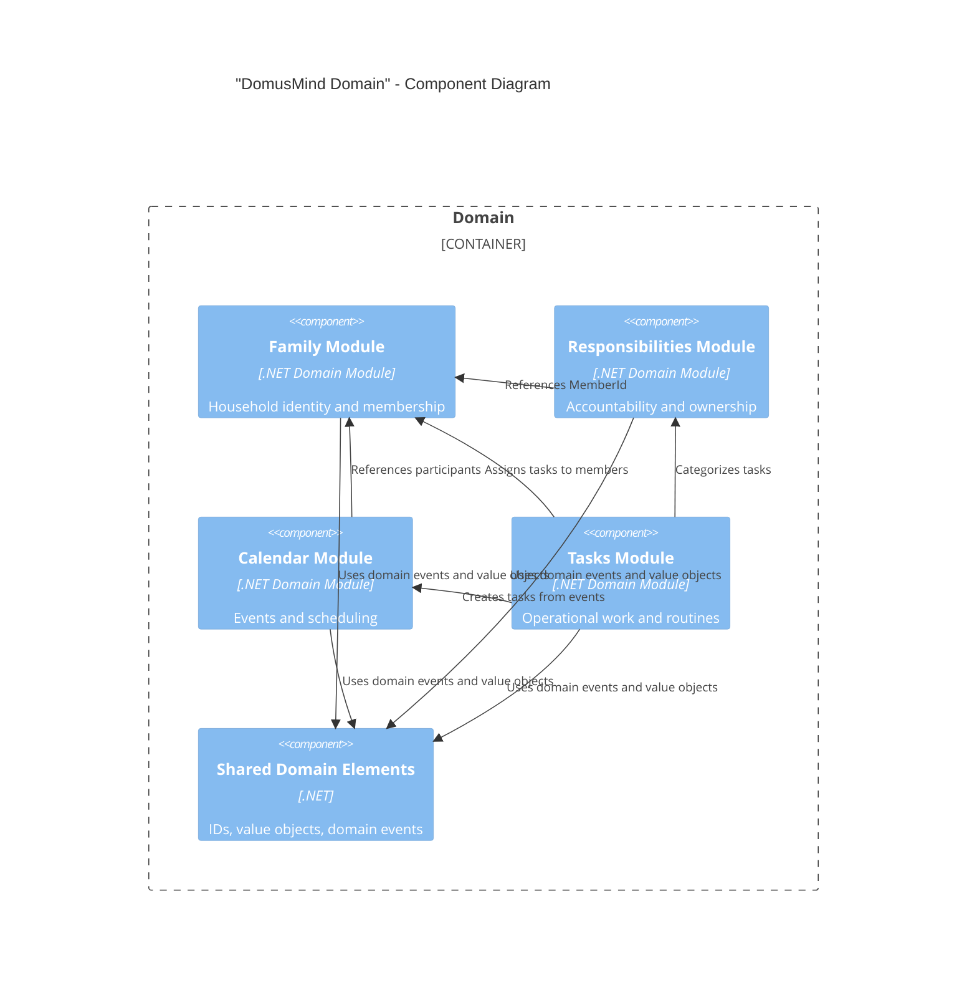

# DomusMind — C4 Component Diagram (Domain)

## Purpose

This document shows the internal component structure of the **"Domain"** container.

The domain layer contains the core business model of DomusMind.  
It defines aggregates, entities, value objects, and domain events.

V1 is built around four core bounded contexts:

- "Family"
- "Responsibilities"
- "Calendar"
- "Tasks"

These modules represent the operational backbone of the household system.

---

## Domain Modules

### "Family"

Defines the household identity structure.

Owns:

- "Family" aggregate
- "Member"
- "Dependent"
- "Pet"
- "Relationship"

Responsibilities:

- household structure
- membership lifecycle
- family identity

Other contexts reference members but cannot modify them.

---

### "Responsibilities"

Defines accountability across the household.

Owns:

- "ResponsibilityDomain" aggregate
- ownership assignments
- participation roles

Responsibilities:

- primary ownership
- secondary ownership
- responsibility distribution

---

### "Calendar"

Defines the temporal structure of family life.

Owns:

- "Event" aggregate
- schedules
- participants
- reminders

Responsibilities:

- scheduling
- time coordination
- timeline construction

---

### "Tasks"

Defines operational execution.

Owns:

- "Task" aggregate
- "Routine" aggregate
- task lifecycle

Responsibilities:

- work execution
- recurring routines
- task completion tracking

---

### "Shared Domain Elements"

Shared concepts used across modules.

Includes:

- domain events
- strongly typed identifiers
- value object primitives

These elements are shared but must remain minimal to avoid coupling.

---

## Diagram

---

## Notes

The domain layer is the **core of DomusMind**.

Rules:

* domain modules must remain independent
* cross-module interaction occurs through domain events
* modules reference identity by ID only
* no module may modify another module’s aggregate

This structure preserves strong boundaries while keeping the system deployable as a modular monolith.
