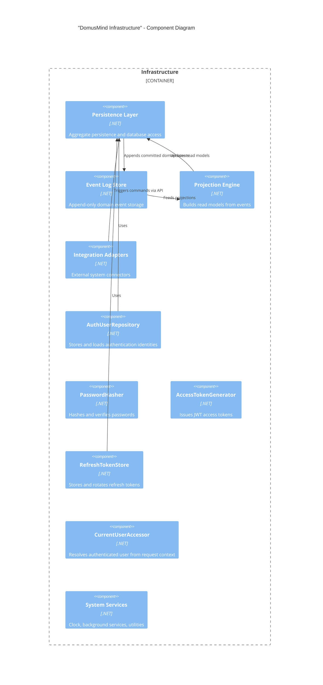

# DomusMind — C4 Component Diagram (Infrastructure)

## Purpose

This document describes the internal components of the **Infrastructure container**.

Infrastructure provides technical capabilities required by the application and domain layers:

- persistence
- event storage
- projections
- integrations
- authentication services

Infrastructure **must not contain domain logic**.

---

## Components

### "Persistence Layer"

Implements storage for aggregates and read models.

Responsibilities:

- load aggregates
- persist aggregates
- manage transactions

Typically implemented using:

- repository implementations
- ORM mappings
- database access abstractions

---

### "Event Log Store"

Append-only storage for domain events.

Responsibilities:

- persist committed domain events
- provide ordered event stream
- enable projections and auditing

Events are written **after aggregate commits**.

---

### "Projection Engine"

Builds read models from domain events.

Responsibilities:

- subscribe to domain events
- update projections
- rebuild read models if needed

Examples of projections:

- family timeline
- task boards
- responsibility matrix

---

### "Integration Adapters"

Technical adapters connecting DomusMind to external systems.

Examples:

- messaging adapters (Telegram)
- calendar integrations
- notification services

Adapters translate external signals into commands.

---

### "Authentication Services"

Implements local authentication and identity persistence.

Responsibilities:

- credential storage
- password hashing and verification
- JWT access token generation
- refresh token persistence
- authenticated user resolution via request context

Typical services include:

- AccessTokenGenerator
- PasswordHasher
- RefreshTokenStore
- CurrentUserAccessor
- AuthUserRepository

Identity data is stored in the primary database alongside other system persistence.

---

### "Clock / System Services"

Provides technical system services used by the application layer.

Examples:

- time provider
- ID generation utilities
- background processing helpers

These services must remain infrastructure concerns.

---

## Diagram

---

## Notes

Infrastructure exists to support the domain and application layers.

Rules:

* no business logic
* no domain rules
* no aggregate behavior

Infrastructure implements **technical mechanisms**, not domain decisions.

Authentication is implemented as **local infrastructure services**, not as an external identity provider.
