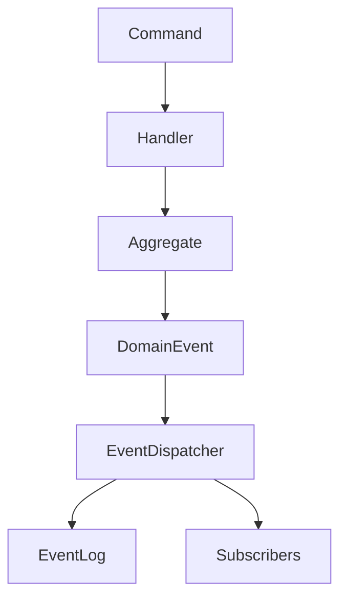

# DomusMind - Event Processing

## Purpose

Defines how domain events are emitted, persisted, and consumed inside the modular monolith.

Events enable:

- module decoupling
- automation
- auditability
- async processing
- future AI pipelines

---

# Event Types

## Domain Events

Emitted by aggregates when state changes.

Examples:

```

EventScheduled
MemberAdded
ResponsibilityAssigned

```

Properties:

- immutable
- past tense
- emitted only after state change

---

## Application / Integration Events

Events consumed by other modules.

Example:

```

EventScheduled
→ Tasks module generates preparation tasks
→ Notifications module schedules reminders

```

---

# Event Flow



---

# Event Dispatching

Events are dispatched in two stages.

## Stage 1 - In-Memory Dispatch

Used for internal module reactions inside the same request.

Example:

```
EventScheduled
→ ReminderCreated
```

---

## Stage 2 - Event Log Persistence

All committed domain events are stored in an **event log**.

Purpose:

* audit history
* retries
* async consumers
* projections
* analytics

---

# Event Log Model

```text
EventLog
- EventId
- EventType
- AggregateType
- AggregateId
- Module
- OccurredAtUtc
- Version
- PayloadJson
- CorrelationId
- CausationId
```

---

# Event Ownership

Each event belongs to exactly one bounded context.

Rules:

```
Only owning module emits event
Other modules may subscribe
Events must not be duplicated across modules
```

---

# Event Consumption

Consumers must be:

```
idempotent
side-effect isolated
tolerant to retries
```

Consumers should not mutate the emitting aggregate.

---

# Event Storage Strategy

Initial implementation:

```
Event log (append-only)
Outbox pattern optional
No event sourcing
```

Future evolution may introduce:

```
event streaming
projections
analytics pipelines
```

---

# Event Stability

Events are long-term contracts.

Rules:

```
avoid breaking payload changes
prefer new events over modifying old ones
version events when necessary
```
