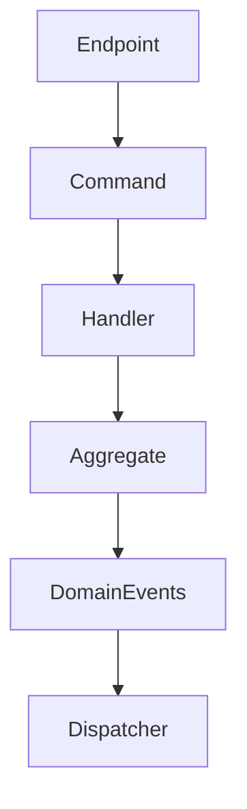

# DomusMind - Vertical Slice Conventions

## Purpose

Defines the structure and rules for implementing features using **vertical slices**.

A slice represents a **single domain capability**.

Example:

```

Schedule Event
Create Family
Assign Responsibility

```

---

# Slice Structure

```text
/features/<module>/<capability>/

Command.cs
Validator.cs
Handler.cs
Endpoint.cs
Tests.cs
```

Optional:

```
Response.cs
Mapping.cs
```

---

# Slice Components

## Command / Query

Represents a domain action.

Examples:

```
ScheduleEventCommand
CreateFamilyCommand
```

Rules:

```
immutable
minimal fields
domain language naming
```

---

## Validator

Validates input before handler execution.

Responsibilities:

```
shape validation
required fields
basic invariants
```

No domain logic.

---

## Handler

Executes the capability.

Responsibilities:

```
load aggregate
execute domain operation
persist changes
emit events
return result
```

Rules:

```
one handler per command/query
one aggregate modification per command
no handler-to-handler calls
```

---

## Endpoint

API adapter.

Responsibilities:

```
receive request
map request → command/query
dispatch
return response
```

Rules:

```
no business logic
thin adapter only
```

---

# Slice Naming

Capability name must reflect **domain language**.

Examples:

```
schedule-event
create-family
assign-primary-owner
create-routine
```

Avoid:

```
create-event-record
update-family-entity
```

---

# Module Boundaries

Slices belong to a module (bounded context).

Example:

```
/features/calendar/schedule-event
/features/family/create-family
/features/responsibilities/assign-owner
```

Rules:

```
a slice cannot access another module's internal code
cross-module reactions occur via events
```

---

# Handler Flow



---

# Testing Strategy

Each slice must include:

```
handler tests
domain invariant tests
```

Optional:

```
endpoint tests
```

Tests should verify:

```
state change
emitted events
invariants
```

---

# Slice Independence

Slices must remain **independent units of change**.

Rules:

```
no shared service layer
no generic repositories
no cross-slice coupling
```

Each slice implements one capability end-to-end.
