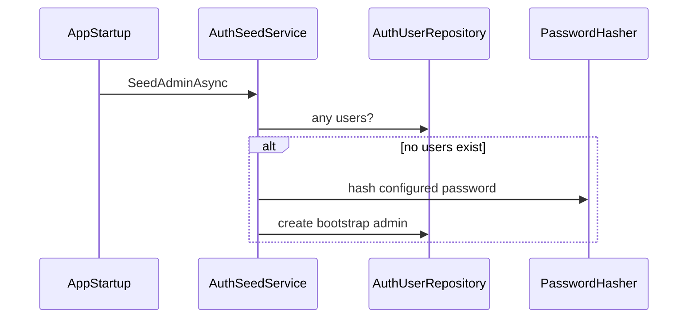

# DomusMind — Security

## Purpose

This document defines the baseline security model for DomusMind V1.

Security in V1 focuses on:

- authentication
- authorization
- family data isolation
- secret handling
- secure defaults

This document reflects both the intended model and the currently implemented authentication baseline.

---

## Authentication

DomusMind V1 uses **local authentication implemented inside the modular monolith**.

Rules:

- authentication is part of the application boundary
- user identity is managed internally
- external identity providers are optional future integrations

Important distinction:

- `User` is an authentication concept
- `Member` is a family domain concept

These must remain separate.

Current implemented baseline:

- local user registration and login
- password hashing and verification
- JWT bearer access tokens
- refresh tokens persisted in the database
- authenticated user resolution from request context

```mermaid
sequenceDiagram
Client->>API: POST /api/auth/login
API->>AuthUserRepository: load user by email
API->>PasswordHasher: verify password
PasswordHasher-->>API: valid / invalid
API->>AccessTokenGenerator: generate JWT
API->>RefreshTokenStore: create refresh token
API-->>Client: accessToken + refreshToken
````

---

## Authorization

Authorization must be family-scoped.

Rules:

* a user may access only the families they belong to or administer
* commands and queries must enforce family isolation
* cross-family access is forbidden by default

Current state:

* authentication is implemented
* family-scoped authorization exists as an application/infrastructure seam
* full family membership enforcement is not yet complete across the whole product surface

V1 authorization can remain simple, but isolation must be strict.

---

## Session Model

DomusMind V1 uses token-based authentication.

Implemented mechanism:

* JWT bearer access tokens
* short-lived access tokens
* refresh tokens stored server-side
* refresh token rotation on renewal

Rules:

* tokens must contain user identity
* tokens must not embed domain state
* authorization checks must verify family membership

Authentication identity and domain identity remain separate:

User → authentication identity
Member → family domain identity

```mermaid
sequenceDiagram
Client->>API: GET /api/auth/me with Bearer token
API->>JWT Middleware: validate token
JWT Middleware-->>API: ClaimsPrincipal
API->>CurrentUserAccessor: resolve current user
CurrentUserAccessor-->>API: user identity
API-->>Client: authenticated response
```

---

## Authorization Model

Authorization is family-scoped.

Typical rules:

* a user may belong to multiple families
* commands must verify membership in the target family
* administrative operations require elevated privileges

Authorization enforcement occurs at:

* API boundary
* application slice handlers

Domain entities remain authorization-agnostic.

---

## Domain Boundary

Authentication and authorization must not pollute the core domain model.

Rules:

* domain entities do not depend on auth framework types
* access checks occur in API, application, or policy boundaries
* family membership in the domain is not the same as login identity

---

## Secret Management

V1 secret handling principles:

* secrets must never be committed to source control
* CI secrets are stored in GitHub Actions secrets
* local development secrets should use environment variables or local secret storage
* no cloud secret manager is required yet

Examples of secrets:

* database connection strings
* signing keys
* notification credentials
* external integration tokens

Current implemented baseline:

* JWT signing key is validated at startup
* invalid or weak signing key configuration fails fast

---

## Transport Security

Production deployments must use HTTPS.

Rules:

* no plaintext auth traffic
* secure cookies or bearer tokens only
* Swagger access may be restricted outside development

---

## Password and Credential Handling

Rules:

* passwords must be hashed using a modern password hashing algorithm
* plaintext passwords must never be stored or logged
* credential reset flows must be explicit and auditable

Current implemented baseline:

* password hashing is performed by infrastructure auth services
* bootstrap admin creation stores only hashed password values

---

## Bootstrap Identity

For local-first setup, DomusMind may create an initial admin user from configuration when the auth store is empty.

Rules:

* bootstrap only runs when explicitly enabled
* bootstrap must be idempotent
* bootstrap must never log plaintext passwords



---

## Auditability

Security-relevant actions should be traceable.

Examples:

* login
* failed login
* family creation
* ownership transfer
* permission-sensitive changes

Domain events and application logs together provide the baseline audit trail.

---

## Data Protection

Household data is sensitive.

Minimum expectations:

* family-level isolation
* least privilege by default
* secure persistence configuration
* controlled exposure in logs and telemetry

Sensitive fields should not be unnecessarily returned or logged.

---

## Future Considerations

Possible later additions:

* external identity providers
* MFA
* device/session management
* per-family roles
* encrypted secret stores
* fine-grained audit dashboards

These are not required for V1.

---

## Summary

DomusMind V1 uses local authentication, JWT bearer access tokens, persisted refresh tokens, strict family-level isolation as the target authorization model, internal secret handling discipline, and secure defaults.

The key architectural rule remains: authentication identity and household domain identity are separate concepts.