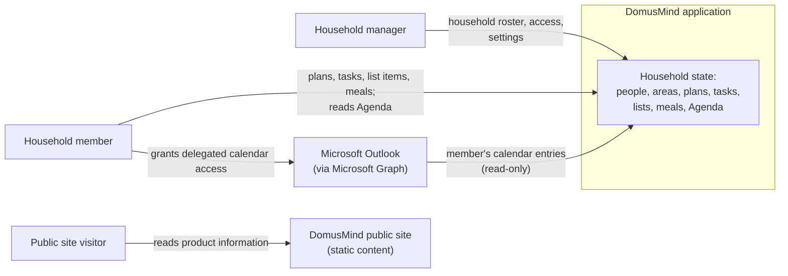

# Context and Scope

The system under description is the **DomusMind application**: the API and the web
app it serves, with its own database. The **public site** is a separate static system
in the same repository; it shares no data or runtime with the application and is
shown only to make that separation explicit.

## Business Context



| Partner | Exchanges with DomusMind |
| --- | --- |
| Household member | Records and reads shared household state; may connect a personal Outlook calendar whose entries appear only in their own Agenda scope. |
| Household manager | Everything a member does, plus the household roster, member access and household settings. |
| Microsoft Outlook | Supplies a member's calendar entries through delegated access. DomusMind only reads; nothing flows back. |
| Public site visitor | Reads static product information on the public site. No exchange with the application; outbound links go to the GitHub repository. |

The two human partners and Outlook are the product's actors:

<!-- pdac:cite id="ACT-HOUSEHOLD-MEMBER" digest="sha256:18173726b69715b42a2c09ddd0c09876f486d1abefd93c3131e2cb0d6c4df860" -->
<!-- pdac:cite id="ACT-HOUSEHOLD-MANAGER" digest="sha256:12dacff31d93a8b994bddadabce84831a7ba4c8bf06eb8a15710b673cd66349b" -->
<!-- pdac:cite id="ACT-MICROSOFT-OUTLOOK" digest="sha256:5f796b186efb4d164fd71462cce88157e4857e7e602f35acffee972881c33f54" -->

The product model also names a calendar sync scheduler actor. Architecturally it is
not a partner but a hosted background worker **inside** the boundary; it appears as an
outbound call to Microsoft Graph below.

<!-- pdac:cite id="ACT-CALENDAR-SYNC-SCHEDULER" digest="sha256:af7e16c4a05a0b76bf10ec69cc19e11e7b47c9dbf5c40adf437a3e842f5f1ef8" -->

The public site visitor has no product-model actor; the site's content is governed by
[`docs/design/public-site.md`](../design/public-site.md).

There are deliberately no other partners. DomusMind sends no email, push
notification or chat message, and has no messaging, voice, home-automation, AI or
further calendar-provider integration: these are outside the current product scope.

<!-- pdac:cite id="CON-PRODUCT-CURRENT-SCOPE" digest="sha256:5f3b2eacf39dd82ebe0c6616860f4f0d9edac9589d0f8889a7e093db12e9e239" -->

## Technical Context

```mermaid
flowchart LR
    browser["Browser<br/>(desktop or mobile)"]
    operator["Self-hosting operator"]
    msid["Microsoft identity platform<br/>login.microsoftonline.com"]
    graph["Microsoft Graph<br/>graph.microsoft.com"]
    ghcr["Container registry<br/>(GHCR)"]
    swa["Azure Static Web Apps"]

    subgraph app["DomusMind application container"]
        web["Web app (SPA files)"]
        api["REST API"]
        worker["Calendar refresh worker"]
    end
    db[("PostgreSQL")]

    browser -- "HTTPS: SPA assets" --> web
    browser -- "HTTPS JSON /api,<br/>JWT bearer" --> api
    browser -- "OAuth authorize redirect" --> msid
    api -- "auth-code exchange,<br/>token refresh (MSAL)" --> msid
    api -- "HTTPS REST, delegated token" --> graph
    worker -- "HTTPS REST, delegated token" --> graph
    api --- db
    worker --- db
    operator -- "pulls image" --> ghcr
    operator -- "environment variables,<br/>first-run setup" --> app
    browser -- "HTTPS: static pages" --> swa
```

The browser is the only client. The SPA and the API are served by the same process
and origin, so the web app calls the API with relative `/api` paths. PostgreSQL is
part of the deployment rather than an external partner; its topology belongs to the
[deployment view](07-deployment-view.md).

| Interface | Partner | Channel and protocol | Direction | Evidence |
| --- | --- | --- | --- | --- |
| Web app delivery | Browser | HTTP(S), static files with SPA fallback | Out | [`Program.cs`](../../src/backend/DomusMind.Api/Program.cs) |
| Household API | Browser (web app) | REST over HTTP(S), JSON, JWT bearer access token with refresh token; OpenAPI at `/swagger` | In / out | [`Controllers/`](../../src/backend/DomusMind.Api/Controllers/), [conventions](08-crosscutting-concepts.md) |
| First-run setup | Operator via browser | Setup endpoints used by the setup wizard; optional bootstrap admin from environment for headless installs | In | [`deploy/.env.example`](../../deploy/.env.example) |
| Configuration | Operator | Environment variables: database connection, JWT signing settings, Microsoft app registration, bootstrap admin | In | [`deploy/docker-compose.yml`](../../deploy/docker-compose.yml) |
| Outlook authorization | Microsoft identity platform | OAuth 2.0 authorization code flow; the API builds the authorize URL, the browser is redirected, the API redeems the code through MSAL and keeps the token cache server-side (encryption depends on configuration, see [section 11](11-risks-and-technical-debt.md)) | Out | [`Integrations/Calendar/Microsoft/`](../../src/backend/DomusMind.Infrastructure/Integrations/Calendar/Microsoft/) |
| Calendar ingestion | Microsoft Graph v1.0 | HTTPS REST: calendar list and `calendarView` delta queries with the delegated `Calendars.Read` scope; pull only, manual or scheduled | Out (read) | [ADR-0003](../adr/0003-use-delegated-graph-auth-for-outlook-calendar-ingestion.md) |
| Image distribution | Container registry | OCI image pulled by the operator | Out of band | [`docker-edge.yml`](../../.github/workflows/docker-edge.yml) |
| Public site | Browser | Static HTML on Azure Static Web Apps; no call to the application | Out | [`src/web/public/`](../../src/web/public/) |
| Email, push, messaging | none | Not implemented | — | No sender in `src/backend` |

## Input and Output Channel Mapping

| Business exchange | Technical channel |
| --- | --- |
| Members and managers record and read household state | Household API, called by the web app in the browser |
| Household and member administration | Household API (manager-authorized endpoints) |
| Member grants Outlook access | Outlook authorization: browser redirect to the Microsoft identity platform, code redeemed by the API |
| Outlook entries reach the member's Agenda | Calendar ingestion from Microsoft Graph, triggered by the member through the API or by the refresh worker; served back through the Household API |
| First household and administrator are created | First-run setup (wizard or bootstrap admin) |
| Visitor reads product information | Public site on Azure Static Web Apps |

Boundary risks (token custody for Outlook connections, the Microsoft app-registration
dependency, transport security in front of the container) are assessed in
[section 11](11-risks-and-technical-debt.md).
