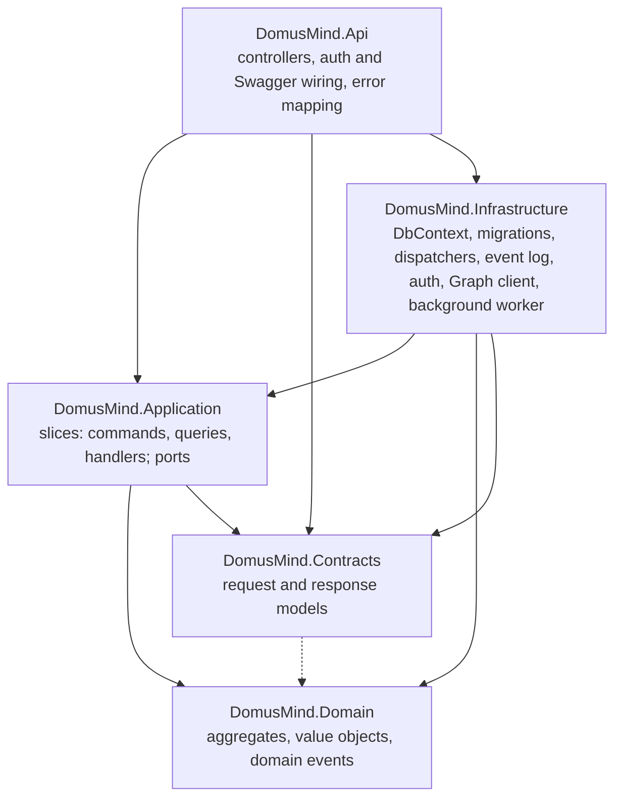
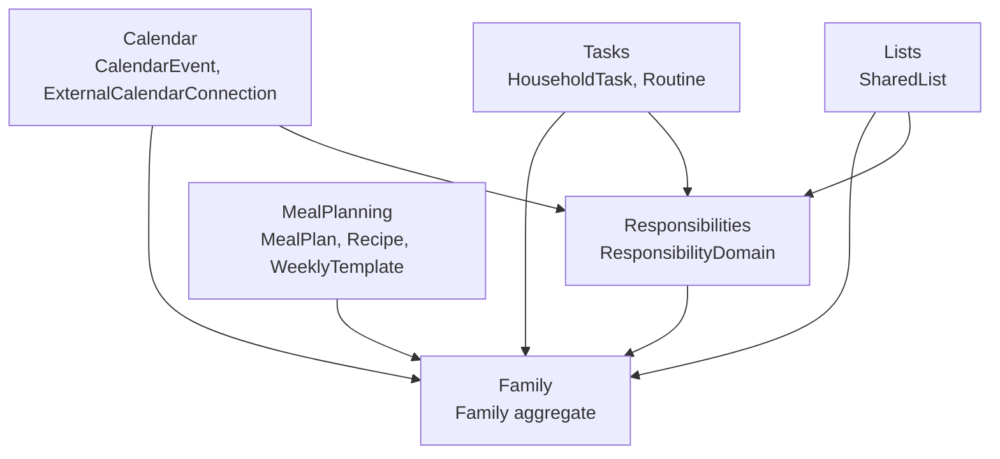

# Building Block View

## Whitebox Overall System

### Overview

DomusMind is one backend process, one relational database and two browser front ends. The household-facing web app is the only client of the HTTP API; the public site is a separate static marketing site with no runtime dependency on the backend. The AppHost composes the backend, the database and the web app for local development only.

```mermaid
flowchart LR
    person([Household member])
    visitor([Site visitor])
    graph[(Microsoft Graph)]

    subgraph domusmind [DomusMind]
        web["Web app<br/>React + Vite SPA"]
        api["DomusMind API<br/>ASP.NET Core modular monolith"]
        db[("DomusMind database<br/>PostgreSQL")]
        apphost["AppHost<br/>.NET Aspire, development only"]
    end

    site["Public site<br/>Astro static site"]

    person --> web
    visitor --> site
    web -- "HTTPS/JSON, JWT bearer" --> api
    api -- "EF Core / Npgsql" --> db
    api -- "delegated OAuth, delta queries" --> graph
    apphost -. "starts and wires" .-> api
    apphost -. "starts and wires" .-> web
    apphost -. "provisions" .-> db
```

### Decomposition Rationale

The backend is a single deployable modular monolith rather than a set of services, see [ADR-0004](../adr/0004-build-a-domain-centric-modular-monolith.md). The web app is built separately but, in the published container image, is served as static files by the API process, so production has one application container plus the database (topology in [section 07](07-deployment-view.md)). The public site is decoupled so it can be deployed and changed independently of the product.

### Contained Building Blocks

| Building block | Responsibility | Interfaces | Source location |
| --- | --- | --- | --- |
| Web app | Household-facing single-page application: Agenda, Lists, Areas, Meal Planning, Settings; holds the session tokens client-side | Consumes the REST API; browser routes | [`src/web/app`](../../src/web/app) |
| DomusMind API | All product behaviour: authentication, authorization, commands, queries, domain model, persistence, external calendar ingestion and its background worker | REST API documented with Swagger ([ADR-0005](../adr/0005-expose-a-rest-api-through-aspnet-core-controllers.md)); serves the web app bundle in production | [`src/backend`](../../src/backend) |
| DomusMind database | Operational state of every aggregate, authentication records, user-to-household access grants and the append-only event log, in one schema | PostgreSQL connection string `domusmind` | EF Core migrations in [`DomusMind.Infrastructure/Persistence`](../../src/backend/DomusMind.Infrastructure/Persistence) |
| Public site | Static product and marketing pages | Static hosting only; no API calls | [`src/web/public`](../../src/web/public) |
| AppHost | Local orchestration: PostgreSQL with pgAdmin, the API and the Vite dev server, wired by references | .NET Aspire app model | [`src/backend/DomusMind.AppHost`](../../src/backend/DomusMind.AppHost) |

### Important Interfaces

- **Web app to API**: JSON over HTTPS under `/api`, authenticated with a bearer access token issued by the API itself ([ADR-0002](../adr/0002-keep-authentication-local-and-separate-from-member-identity.md)). The web app keeps hand-written typed wrappers under [`src/web/app/src/api`](../../src/web/app/src/api); the OpenAPI document is the contract.
- **API to Microsoft Graph**: outbound only, delegated per connected member, read-only calendar scope ([ADR-0003](../adr/0003-use-delegated-graph-auth-for-outlook-calendar-ingestion.md)). The external interface itself is owned by [section 03](03-context-and-scope.md).

## Level 2

### Whitebox: DomusMind API

The API container is split into five projects with a strict inward dependency direction. The domain project references nothing; every other project depends on it directly or transitively.



| Building block | Responsibility | Interfaces |
| --- | --- | --- |
| `DomusMind.Api` | Thin HTTP adapter: controllers map requests to commands or queries, read the current user, dispatch, and map application exceptions to status codes; composition root for DI, JWT bearer authentication, Swagger and the SPA fallback | Uses `ICommandDispatcher` and `IQueryDispatcher` only |
| `DomusMind.Application` | One vertical slice per capability; defines the ports it needs (messaging contracts, `IDomusMindDbContext`, `IEventLogWriter`, security and integration abstractions) | Mediator contracts of [ADR-0001](../adr/0001-use-an-internal-application-mediator.md); uses EF Core directly through `IDomusMindDbContext` ([ADR-0007](../adr/0007-use-ef-core-directly-without-generic-repositories.md)) |
| `DomusMind.Contracts` | Explicit API request and response models, grouped by module; handlers return them and controllers serialize them, so domain types never cross the HTTP boundary ([ADR-0006](../adr/0006-map-explicitly-without-automapper.md)) | Plain records |
| `DomusMind.Domain` | Framework-free business model: aggregates, entities, value objects, strongly typed identifiers (GUID-backed record structs, [ADR-0010](../adr/0010-use-guid-backed-strongly-typed-identifiers.md)) and domain events | `AggregateRoot` raises `IDomainEvent`s; no outbound dependencies |
| `DomusMind.Infrastructure` | Implements the ports: PostgreSQL `DbContext` and mappings, reflection-based dispatchers, event log writer, local authentication services, Microsoft Graph auth and calendar client, the external calendar refresh worker | Registered by `AddInfrastructure` and the auth extensions in `Program.cs` |

The dashed edge is a project reference from `DomusMind.Contracts` to `DomusMind.Domain` that no contract type uses; contracts carry identifiers as primitives.

Platform slices that are not bounded contexts also live in the application layer: `Auth` (sign-in, tokens, password change), `Setup` (first-run system initialization) and `Languages` (supported UI languages).

## Level 3

### Whitebox: Bounded-context modules

Each bounded context is a module that appears with the same name in `Domain`, `Application/Features`, `Contracts` and, through controllers, in `Api`. The module boundaries follow the product's separation of time, execution, ownership and capture.

<!-- pdac:cite id="CON-PRODUCT-SEPARATE-AXES" digest="sha256:740fa2cc41d90ec6afb099c5f97fa44e9092af8d83cd68291f807262387a44b0" -->



Arrows are domain-level references and point at the module whose identifier type is used. In the domain project, modules reference each other only through strongly typed identifiers (`FamilyId`, `MemberId`, `ResponsibilityDomainId`); no aggregate holds or changes another module's aggregate. References to Calendar, Lists and Meal Planning entities from other modules (a list linked to a plan, a shopping list linked to a meal plan) are stored as untyped link fields, so these modules have no domain-level dependency on each other. Each command handler changes one aggregate and cross-module reactions go through domain events ([ADR-0008](../adr/0008-collaborate-across-modules-through-persisted-domain-events.md)); [section 06](06-runtime-view.md) shows where the current handlers depart from that rule.

| Module | Architectural responsibility | Aggregate roots | Source location |
| --- | --- | --- | --- |
| Family | Upstream identity provider: the household and its members (adults, children and pets are member roles; there are no separate dependent, pet or relationship entities); issues the identifiers every other module uses. A member optionally holds the id of a sign-in account, which stays a separate concept from the member | `Family` | [`Domain/Family`](../../src/backend/DomusMind.Domain/Family), [`Features/Family`](../../src/backend/DomusMind.Application/Features/Family) |
| Responsibilities | Areas of accountability and their owner and support assignments; referenced as optional context by Calendar, Tasks and Lists | `ResponsibilityDomain` | [`Domain/Responsibilities`](../../src/backend/DomusMind.Domain/Responsibilities), [`Features/Responsibilities`](../../src/backend/DomusMind.Application/Features/Responsibilities) |
| Calendar | Native plans with schedules, participants and reminders; separately, member-scoped external calendar connections whose imported entries are read-only integration state, never native events | `CalendarEvent`, `ExternalCalendarConnection` | [`Domain/Calendar`](../../src/backend/DomusMind.Domain/Calendar), [`Features/Calendar`](../../src/backend/DomusMind.Application/Features/Calendar) |
| Tasks | Structured execution: tasks with a lifecycle and assignee, and routines that recur | `HouseholdTask`, `Routine` | [`Domain/Tasks`](../../src/backend/DomusMind.Domain/Tasks), [`Features/Tasks`](../../src/backend/DomusMind.Application/Features/Tasks) |
| Lists | Reusable capture containers and their items, including optional temporal fields that make items eligible for Agenda projection | `SharedList` | [`Domain/Lists`](../../src/backend/DomusMind.Domain/Lists), [`Features/Lists`](../../src/backend/DomusMind.Application/Features/Lists) |
| MealPlanning | Weekly meal plans and slots, the recipe library and weekly templates; requests shopping lists that then belong to Lists | `MealPlan`, `Recipe`, `WeeklyTemplate` | [`Domain/MealPlanning`](../../src/backend/DomusMind.Domain/MealPlanning), [`Features/MealPlanning`](../../src/backend/DomusMind.Application/Features/MealPlanning) |

The product responsibility of each module is owned by its bounded-context artifact; the table above only states how the code realizes it.

<!-- pdac:cite id="BC-FAMILY" digest="sha256:3bf7d1e482866302ac3725ac77eed6a5f37cebf2ba60a99323a37194c8f187ae" -->
<!-- pdac:cite id="BC-RESPONSIBILITIES" digest="sha256:288de55e6b2023b73e2a4c9992f9390250c4a7690500cd4d6a207c432f324cc5" -->
<!-- pdac:cite id="BC-CALENDAR" digest="sha256:672274e54e0fbc3961c16ed85b7c8a6db31b7ff828ca0a88304a049be3389c0f" -->
<!-- pdac:cite id="BC-TASKS" digest="sha256:7a1a64e2267e7795b9766611ab9d65af92e80600a128617a728d4bff899a032d" -->
<!-- pdac:cite id="BC-LISTS" digest="sha256:278bab0e63c76bf592a652d1a53fcaf99a6a79cf52153a4d566d26dfcd1bf0e0" -->
<!-- pdac:cite id="BC-MEAL-PLANNING" digest="sha256:3e2d211a42325e9e719480512210f6ec9c5255f4fa647518cae3598e2bd6e835" -->

Cross-module read models are not owned by any single module. The Agenda week grid and household timeline queries live under `Features/Family` and the member agenda under `Features/Calendar`, and each reads the aggregates of several modules directly through `IDomusMindDbContext` (see [section 06](06-runtime-view.md)).

### Whitebox: Vertical slice

A capability is one folder, `Features/<Module>/<Capability>`, named in the ubiquitous language (for example `Features/Calendar/ScheduleEvent`, `Features/MealPlanning/RequestShoppingList`). A slice contains only what it needs:

| Element | Responsibility |
| --- | --- |
| `<Capability>Command` or `<Capability>Query` | Immutable record implementing `ICommand<TResponse>` or `IQuery<TResponse>`, carrying the requesting user's id |
| `<Capability>CommandHandler` or `<Capability>QueryHandler` | Authorizes access to the household, loads or creates one aggregate, invokes domain behaviour, persists and writes the raised events to the event log, and maps the result to a `Contracts` response; queries project with `AsNoTracking()` |
| Response model | In `DomusMind.Contracts/<Module>`, not in the slice folder |
| HTTP endpoint | An action on a module controller in `DomusMind.Api/Controllers`, not a per-slice endpoint file |

Slices do not call other handlers, and there is no shared service layer between them. The `IValidator<T>` contract exists in the application layer but has no implementations; input validation currently happens inside handlers and value-object factories. The coding conventions that apply across slices are owned by [section 08](08-crosscutting-concepts.md).
