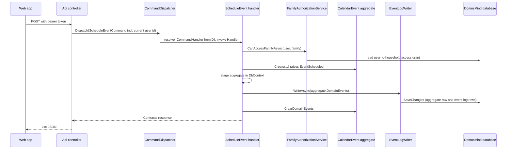
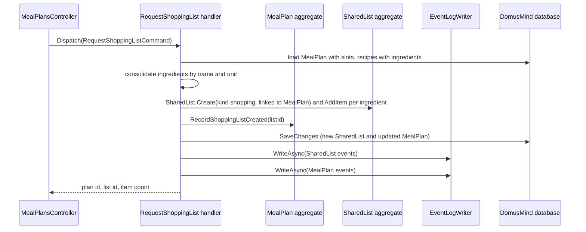
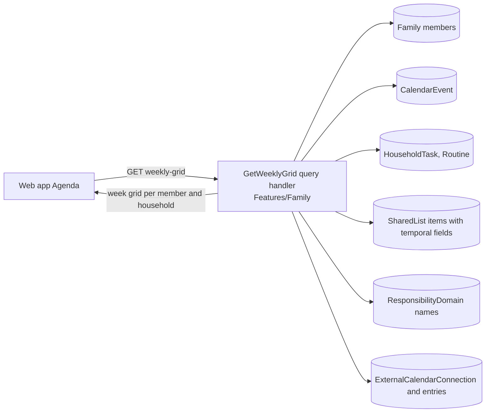
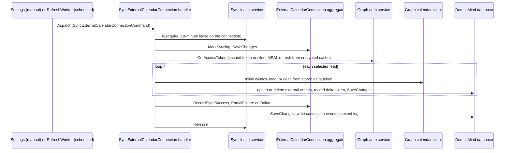

# Runtime View

Participants are the building blocks of [section 05](05-building-block-view.md). Each scenario describes the code as it runs today; where it differs from the intended design the difference is stated and tracked in [section 11](11-risks-and-technical-debt.md).

## Command through the internal dispatcher

Every state change follows the same path through the internal mediator ([ADR-0001](../adr/0001-use-an-internal-application-mediator.md)). Scheduling a plan is representative.



### Notable Interactions

- The controller adds only the authenticated user's id to the command; the handler decides access to the household and enforces it itself. There is no dispatcher pipeline: validation, authorization and mapping happen inside the handler.
- One handler changes one aggregate and writes the events that aggregate raised to the append-only event log in the same database ([ADR-0008](../adr/0008-collaborate-across-modules-through-persisted-domain-events.md)). The event log is the only consumer of domain events at run time.
- The sequence shows the common persistence order, in which the event log writer's `SaveChanges` commits aggregate and events together. Some handlers save the aggregate first and write the events in a second `SaveChanges`, so a failure between the two leaves a committed state change with no logged event. Which handlers do this, and which log columns are not yet populated, is owned by [section 08](08-crosscutting-concepts.md#domain-events-and-the-event-log).

Queries follow the same shape through `QueryDispatcher` to a query handler that reads with `AsNoTracking()` projections and returns a `Contracts` model; they write nothing.

### Failure Behavior

Handlers throw a module-specific exception (for example `CalendarException` with an error code); controllers translate those into 400, 403 or 404 responses. A missing handler registration raises `HandlerResolutionException`, which the global exception handler maps to a 500 response with a `handler_resolution_failed` code; any other unhandled exception becomes a generic 500 with a trace id.

## Cross-module reaction: shopping list from a meal plan

The intended collaboration is event-driven: Meal Planning would emit a fact, and Lists would react by creating a list in its own command ([ADR-0008](../adr/0008-collaborate-across-modules-through-persisted-domain-events.md)). That path is not wired: `IDomainEventDispatcher` is registered but never invoked and no `IDomainEventHandler` implementation exists, so no module reacts to another module's events today. The derivation runs synchronously inside one Meal Planning command instead.



### Notable Interactions

- The new list is a regular `SharedList` from the moment it exists and is linked back to the meal plan only through its untyped link fields; after creation Meal Planning keeps a reference to it and has no further interaction with it.
  <!-- pdac:cite id="BR-MEALS-SHOPPING-LIST-NEW-EACH-TIME" digest="sha256:66bbb87ee56438054657395a8491fb49c3b1c8b4ded3b5451c8c3933b50f08e1" -->
- The command creates an aggregate of the Lists module and changes a MealPlan in one transaction, which departs from the one-aggregate-per-command rule and from event-only collaboration. Creating a list linked to a plan (`Features/Lists/CreateLinkedListForEvent`) reads the Calendar aggregate directly but changes only the list.

### Failure Behavior

The aggregates are committed together; the two event log writes follow in separate `SaveChanges` calls, so a failure there leaves both state changes committed without their logged events. A plan with no recipe slots is rejected before anything is written.

## Agenda read projection

The Agenda is assembled at read time; it has no stored projection and no event subscribers. The web app's Agenda (household and member scope, day, week and month) is fed by one query, the weekly grid, which reads the aggregates of several modules directly through `IDomusMindDbContext`.



### Notable Interactions

- Each source module stays the owner of its entries; the projection is read-only and the web app edits an entry by navigating to its owning surface, which calls that module's commands.
  <!-- pdac:cite id="BR-AGENDA-PROJECTION-READ-ONLY" digest="sha256:652b5a6581672dfbabf8e5da42d010cc34d51bbcbf5b2bc73fac9273bb631337" -->
- Imported external entries are added only to the row of the member who owns the connection.
  <!-- pdac:cite id="BR-CALENDAR-EXTERNAL-ENTRIES-OWNER-SCOPE-ONLY" digest="sha256:b1dcb8fae830badbc584fe2a2e8b3ec117053470d9123391b2fa0d69f6bc9e69" -->
- Recurring routines and repeating list items are expanded into occurrences in the query (`Application/Temporal`), not stored as occurrences.
- Meal Planning is not part of the grid. A separate meal-plan agenda query exists (`Features/MealPlanning/GetMealPlansForAgenda`) and a member agenda query exists (`Features/Calendar/GetMemberAgenda`), but the web app calls neither, so meals do not appear in the Agenda today.
  <!-- pdac:cite id="FR-MEALS-AGENDA-PROJECTION" digest="sha256:14542a51f00845c388cd4e159f50674eca6d349656eacac4935fa63b064cd244" -->

## External calendar sync with Outlook

External calendars are ingested one way, from Microsoft Graph into Calendar-owned integration records, with delegated per-member access ([ADR-0003](../adr/0003-use-delegated-graph-auth-for-outlook-calendar-ingestion.md)).

<!-- pdac:cite id="CON-CALENDAR-OUTLOOK-PULL-ONLY" digest="sha256:7c5c21e2aa317fb9e77b5e4feafe491cfd68b7506203b47bae37b46392d185cb" -->

Two triggers converge on the same command: a member's manual sync from Settings, and the `ExternalCalendarRefreshWorker` hosted service, which wakes every 300 seconds, selects up to 10 due connections (scheduled refresh enabled, not disconnected or auth-expired, next sync time reached, no live lease) and dispatches the sync for each with a small random delay. Each connection's next sync is scheduled from its own interval, 60 minutes by default.

<!-- pdac:cite id="FR-CALENDAR-SYNC-EXTERNAL-CALENDAR" digest="sha256:2e4013f14b0b0d3092f017991253bd2441931459bd1db5b24d0bc5a6c00dc423" -->
<!-- pdac:cite id="FR-CALENDAR-BACKGROUND-REFRESH" digest="sha256:4a820cb4807164b225e417fbb59c0b4cba8a5b188bde26f1821e62a258b2aeb4" -->



### Notable Interactions

- The lease stored on the connection prevents a connection from syncing twice at once, whether the second trigger is manual or scheduled; a manual sync during a running one is rejected as in progress.
  <!-- pdac:cite id="BR-CALENDAR-NO-CONCURRENT-SYNC" digest="sha256:85649c4ba718266f5043e7a39f97fef18f3cdaec34b67e91bdb207cedb87974b" -->
- The first sync of a feed loads the sync window computed from the connection's horizon; later syncs use the Graph delta token. Changing the horizon invalidates every feed's delta state so the next run reloads the window.
- Imported entries are stored only as Calendar integration records and never create native plans.
- The catch-up sync on sign-in or on opening a member's Agenda is not implemented: the API exposes a sync-all endpoint for a member, but the web app never calls it.

### Failure Behavior

- A feed that fails is logged and counted; the other feeds continue, and the connection records partial failure or, when all feeds fail, failure. In the worker, one connection's failure is logged and the batch continues.
- When no access token can be obtained the connection is marked auth-expired, which excludes it from scheduled refresh until the member reconnects.
- The lease is always released in a `finally` path; if the process dies, the lease expires after 10 minutes and the worker picks the connection up again.
- There is no recovery path for a delta token the provider rejects: the feed fails on every run until the horizon changes or the member reconnects.

## Authentication and sign-in

Authentication is local to the API and separate from household membership ([ADR-0002](../adr/0002-keep-authentication-local-and-separate-from-member-identity.md)). The mechanisms (hashing, token formats, lifetimes, storage) are owned by [section 08](08-crosscutting-concepts.md).

```mermaid
sequenceDiagram
    participant Web as Web app
    participant AC as AuthController
    participant H as Login handler
    participant Users as AuthUserRepository
    participant RT as RefreshTokenStore
    participant DB as DomusMind database

    Web->>AC: POST /api/auth/login (email, password)
    AC->>H: Dispatch(LoginCommand)
    H->>Users: find by normalized email, verify password hash
    H->>H: reject if disabled; issue JWT access token
    H->>RT: create refresh token (stored hashed)
    RT->>DB: insert
    H-->>Web: access token, refresh token, must-change-password flag
    Web->>AC: GET /api/auth/me (bearer)
    Note over Web: tokens kept in browser storage
    Web->>AC: later requests carry the bearer token
    AC->>AC: JWT bearer middleware validates; CurrentUserAccessor exposes user id
```

### Notable Interactions

- The authenticated principal is an auth user, not a household member. Which households a user may act in is resolved per command or query from the user-to-household access table by `FamilyAuthorizationService`; a member is linked to an auth user only through an optional account id on the member.
  <!-- pdac:cite id="TERM-MEMBER-ACCESS" digest="sha256:b7985c2011d508e2f15b31f8079b9dd54cd5c3603870e83324c4892601f1593b" -->
- On load, the web app validates its stored access token with `/api/auth/me`; if that fails it exchanges the refresh token once, which rotates it (the old one is revoked), and otherwise clears the session. There is no refresh on a 401 during normal use.

### Failure Behavior

Wrong credentials and an unknown email return the same invalid-credentials error; a disabled account is refused after the password check. An invalid, expired or revoked refresh token returns 401 and the web app falls back to the sign-in screen.
