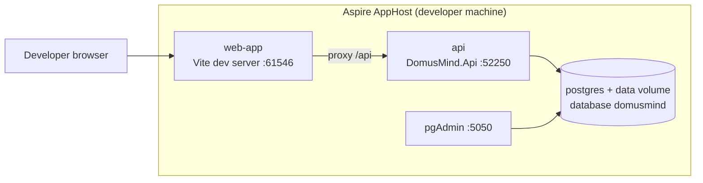

# Deployment View

DomusMind has three materially different deployment variants: the **self-hosted household installation** (the product runtime), the **public site** (marketing and documentation, no product data), and the **local development environment**. The build and release pipelines that produce the artifacts are operational concerns and live in [DevOps](../devops.md).

## Infrastructure Level 1: Self-Hosted Installation

### Overview

A household runs DomusMind on one Docker host as a two-service Compose stack defined in [`deploy/docker-compose.yml`](../../deploy/docker-compose.yml). The operator supplies installation values in a host-side `.env` (template: [`deploy/.env.example`](../../deploy/.env.example)) and, for external access, their own TLS-terminating reverse proxy.

```mermaid
flowchart LR
    browser["Household browser<br/>(web app SPA)"]
    proxy["Reverse proxy<br/>(operator-provided, TLS)"]
    ghcr[("GHCR<br/>ghcr.io/&lt;owner&gt;/domusmind")]
    graph["Microsoft identity platform<br/>and Graph API"]

    subgraph host["Docker host (one household)"]
        subgraph compose["Compose network"]
            app["domusmind container<br/>ASP.NET Core :8080<br/>API + SPA + Swagger<br/>calendar refresh worker"]
            db[("postgres container<br/>PostgreSQL 17<br/>database domusmind")]
        end
        vol[["volume postgres_data"]]
    end

    browser -- HTTPS --> proxy
    proxy -- "HTTP host:APP_PORT (default 24365)" --> app
    app -- "Npgsql, internal only" --> db
    db --- vol
    app -- "HTTPS outbound (optional)" --> graph
    ghcr -. "docker compose pull" .-> app
```

- **`domusmind`** is the only published service. Its image is built by [`src/backend/DomusMind.Api/Dockerfile`](../../src/backend/DomusMind.Api/Dockerfile): a Node stage builds the web app, a .NET SDK stage publishes the API with the web app's `dist` copied into `wwwroot`, and the runtime stage is `mcr.microsoft.com/dotnet/aspnet:10.0` listening on plain HTTP port 8080. The container maps to host port `APP_PORT` (default `24365`).
- **`postgres`** (`postgres:17-alpine`) has no host port; only the app reaches it over the Compose network. The app waits for its `pg_isready` health check before starting.
- **`postgres_data`** is the only persistent volume and holds all application state, including the append-only event log, authentication users and refresh tokens, and encrypted external-calendar token caches. It is the unit of backup (see [DevOps](../devops.md#backup-and-restore)).
- **Reverse proxy** is not part of the stack. The container speaks HTTP only; HTTPS and external exposure are the operator's responsibility, following the pattern `https://domusmind.example.com -> http://host:24365`.
- **Microsoft identity platform and Graph** are reached outbound only when a member connects an Outlook calendar; the Graph client and the periodic refresh worker run inside the `domusmind` process (see [ADR-0003](../adr/0003-use-delegated-graph-auth-for-outlook-calendar-ingestion.md)).

On every start the application applies pending EF Core migrations, then runs the optional bootstrap-admin seed and the supported-language seed before serving requests ([`Program.cs`](../../src/backend/DomusMind.Api/Program.cs)). There is no separate migration job.

### Topology Rationale

One household installs one instance, and the whole product ships as one image because the backend is a single modular monolith ([ADR-0004](../adr/0004-build-a-domain-centric-modular-monolith.md)) and the web app is served from that same process, so the browser always talks same-origin to `/api` and no CORS or second web server is needed. Multi-tenant hosting is not a driver of the topology.
<!-- pdac:cite id="CON-PRODUCT-CURRENT-SCOPE" digest="sha256:5f3b2eacf39dd82ebe0c6616860f4f0d9edac9589d0f8889a7e093db12e9e239" -->

Keeping PostgreSQL off the host network makes the application the single entry point to household data; all authentication and family-scoped authorization happen in that process (see [Crosscutting Concepts](08-crosscutting-concepts.md#authentication-authorization-and-identity-separation)).

### Quality and Performance Characteristics

- **Single instance.** The stack runs one application replica. The external-calendar sync lease (a database-backed lease per connection) prevents overlapping syncs between the worker and user-triggered syncs, but nothing else is designed for horizontal scale-out.
- **Availability** relies on `restart: unless-stopped` for both services. Only PostgreSQL has a Compose health check; the application exposes `GET /api/system/ping` but the stack does not probe it.
- **Upgrades** replace the image and restart; schema migration happens at startup, so an upgrade is a restart that may take longer while migrations run.
- **Transport security** is outside the container. The pipeline calls `UseHttpsRedirection` but the container has no HTTPS listener, and forwarded-header processing is not configured, so the application sees the proxy as the client.

### Building Block Mapping

| Building block or artifact | Infrastructure element | Environment |
| --- | --- | --- |
| `DomusMind.Api` with `Application`, `Domain`, `Infrastructure`, `Contracts` (one process) | `domusmind` container, port 8080 | Self-hosted |
| Web app (`src/web/app`, React + Vite build) | Static files in the `domusmind` container's `wwwroot`, SPA fallback in ASP.NET Core | Self-hosted |
| `ExternalCalendarRefreshWorker` hosted service | Inside the `domusmind` process | Self-hosted |
| `DomusMindDbContext` schema and event log | `postgres` container, database `domusmind`, volume `postgres_data` | Self-hosted |
| Container image | GHCR `ghcr.io/<owner>/domusmind` | Registry |
| Compose file, `.env.example`, install README | GitHub Release assets | Distribution |

## Infrastructure Level 1: Public Site

The public site ([`src/web/public`](../../src/web/public), Astro, `https://domusmind.org`) is a static build deployed to **Azure Static Web Apps** by [`public-site-cd.yml`](../../.github/workflows/public-site-cd.yml) on pushes to `main` that touch it. It has no API, holds no household data and shares no runtime with the product; [`staticwebapp.config.json`](../../src/web/public/staticwebapp.config.json) only configures navigation fallback.

| Building block or artifact | Infrastructure element | Environment |
| --- | --- | --- |
| Public site static build (`dist`) | Azure Static Web Apps (GitHub environment `production`) | Hosted |

## Infrastructure Level 1: Local Development

Development uses .NET Aspire through [`DomusMind.AppHost`](../../src/backend/DomusMind.AppHost/AppHost.cs); it is never used in production.



Aspire provisions PostgreSQL with a data volume and pgAdmin, injects the `domusmind` connection string into the API, and runs the web app from source through Vite, which proxies `/api` to the API. Unlike the self-hosted image, the SPA is not served by ASP.NET Core here; with no `wwwroot`, the API root redirects to Swagger.

| Building block or artifact | Infrastructure element | Environment |
| --- | --- | --- |
| `DomusMind.Api` | Aspire project resource `api` | Development |
| Web app source | Aspire Vite resource `web-app` | Development |
| Database | Aspire PostgreSQL resource with pgAdmin | Development |
